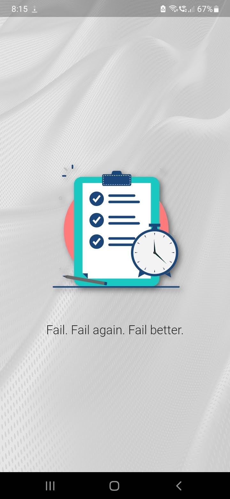
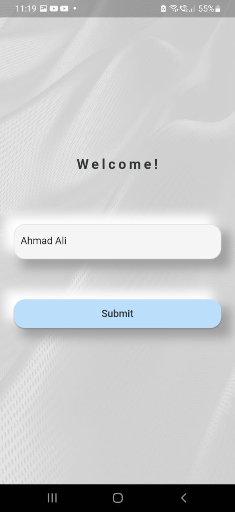
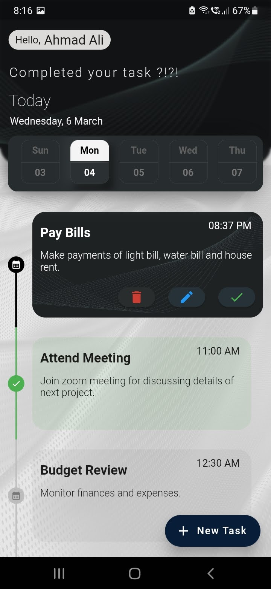
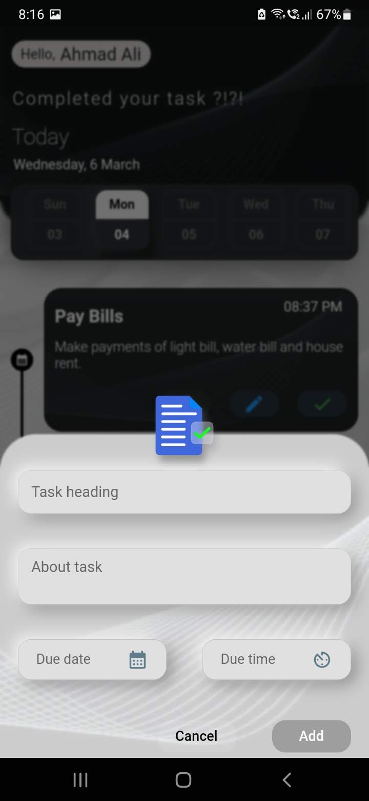
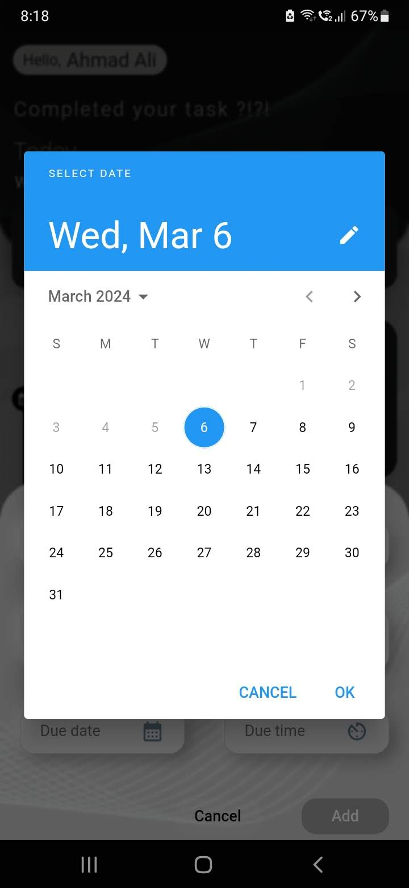
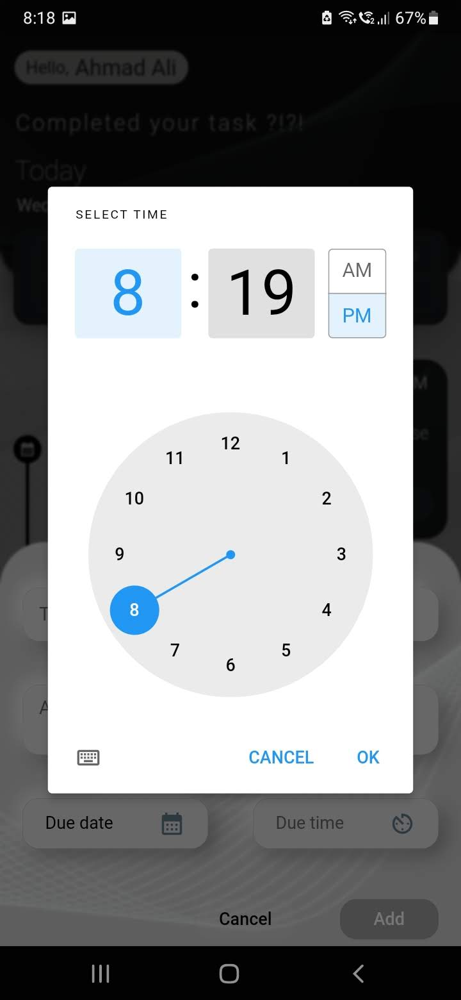
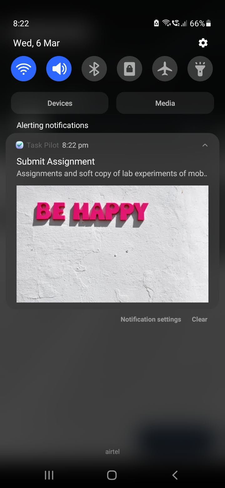

# INTERNSHIP-1 (App Development)

## Bharat Intern 

Welcome to my app development internship at Bharat-Intern! In this internship, I've developed two Flutter applications: a to-do list app and a weather forecast app. This is the readme file of To Do app.

## To-Do App

The to-do list app helps users keep track of their tasks efficiently. Here are some key features:

- **Task Management**: Users can add, edit, and delete tasks.
- **Due Date and Time**: Users can set due dates and times for their tasks.
- **Title and Description**: Users can add titles and descriptions to their tasks.
- **Local Data Storage**: The app uses Hive as local data storage to persist tasks across sessions.

### Screenshots

 &nbsp;&nbsp;&nbsp;&nbsp;  &nbsp;&nbsp;&nbsp;&nbsp;  &nbsp;&nbsp;&nbsp;&nbsp; 
 
 
 &nbsp;&nbsp;&nbsp;&nbsp;  &nbsp;&nbsp;&nbsp;&nbsp;  &nbsp;&nbsp;&nbsp;&nbsp; 
 

https://github.com/ahmad-dev7/to_do_app/assets/126844715/ba0b1197-6c8a-4bb4-8eaf-e8a9b9ed9fea

## Contribution

### Open for pull requests || Raising issues

Feel free to contribute to the improvement of these apps by opening issues or submitting pull requests.
